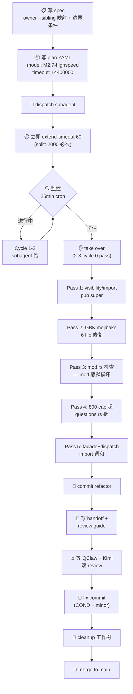
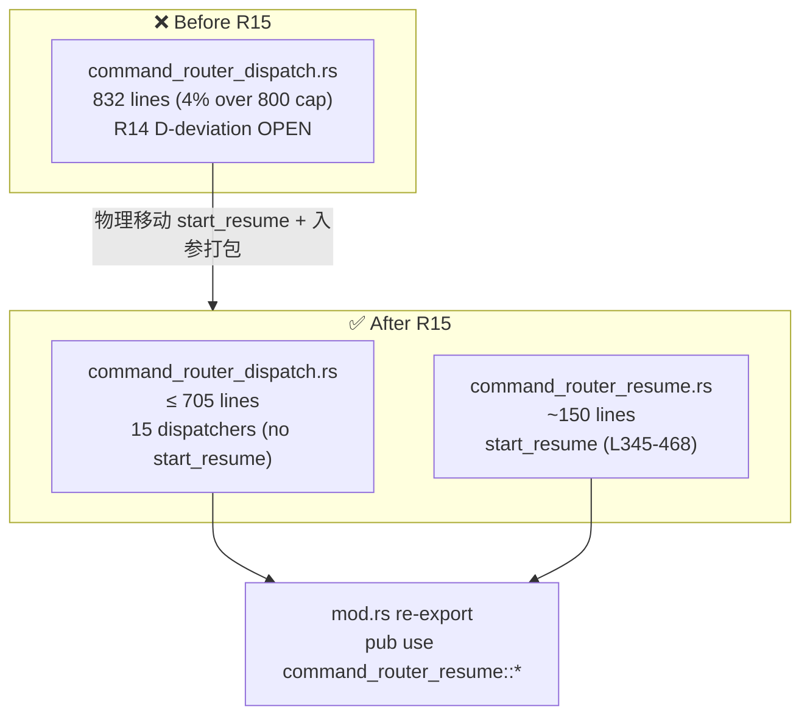
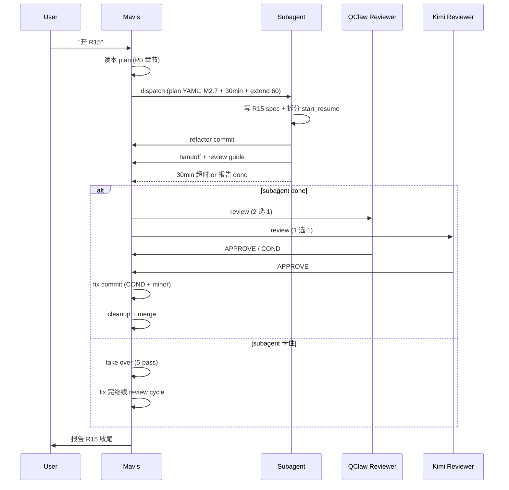

# R15+ Plan — God-object Decomposition Queue (2026-06-30)

> **Status**: drafted at R14 close (`b882e1e`)
> **Author**: Mavis (after Kimi 8.6/10 + QClaw 7.5/10 COND both APPROVE on R14)
> **User mode**: personal pace, side project (per user.md 2026-06-29)

---

## P0 — R15 (next round, mandatory)

### Goal
Close the last D-deviation from R14: `command_router_dispatch.rs` 832 lines (32 over 800 cap, 4% over). After R15: dispatch.rs ≤ 705 lines, R14 D-deviation list fully clean.

### Scope
Extract `start_resume` (god method) from `command_router_dispatch.rs` (L345-468, 127 lines) to a new sibling file `command_router_resume.rs`.

### Why `start_resume` first (not the others)
1. **Size**: 127 lines, biggest single dispatcher in dispatch.rs. Removes it cuts the file by 15%.
2. **Natural cohesion**: `start_resume` only depends on `BotDisplayMode` + `BotChatState` + `PersistenceManager` + `PathManager` + `BotStrings`. It already self-contains the workspace-resolution logic, page-size iteration, body rendering, and pending-action set.
3. **Low coupling**: only callers are `dispatch` (one match arm) and `route_pending` (SelectSession handler, which calls `start_resume(state, page + 1, s)`). Two callers, easy to add `pub use` re-export in facade if needed (R14 pattern).
4. **QClaw R15 COND explicit**: review report `ca3bc2f` listed it as R15 P0.

### Plan template
Same as R14 (sub-domain split pattern, fully documented in `docs/handoffs/2026-06-29-round14-command-router-split-spec.md`):
- Facade (`command_router.rs`) re-exports `start_resume` via `pub use` if needed (R14 used this for `execute_forwarded_turn`).
- Sibling file uses `pub(super)` for all cross-sibling symbols (R9 + R13b Kimi-confirmed standard).
- Test file (`command_router_tests.rs`) already covers `start_resume` indirectly via `pending_expires_after_ttl` and `active_workspace_path_prefers_pro_workspace_then_assistant`. No new tests needed for the extraction itself; add 2-3 tests for the new sibling if extracting helpers.

### Plan YAML mandatory fields (R14 lessons applied)
```yaml
version: 1
plan:
 name: "round15-start-resume-extract-2026-06-30"
 max_concurrency: 1
 max_consecutive_failures: 2
 auto_accept: false
 auto_reject_retries: 1
tasks:
 - id: extract-start-resume
 assigned_to: coder
 role: produce
 verified_by: verifier
 timeout_ms: 14400000
 hang_alert_after_ms: 7200000
 model: minimax/MiniMax-M2.7-highspeed # NOT M3 — M3 silent-thinking eats 39+ min
 prompt: |
 # R15: Extract start_resume from command_router_dispatch.rs to command_router_resume.rs

 ...

 ## SKILLS TO USE (mandatory)
 - contributing-to-mature-project: for R14 split pattern compliance
 - Mavis MEMORY R14 lessons section for the 5 encoding traps

 ## Mandatory preflight checks
 1. cargo check -p northhing-core --tests --features 'service-integrations,product-full' on main HEAD b882e1e (capture baseline)
 2. Read MEMORY R14 lessons section before touching any .rs file
 3. Use ONLY Python with encoding='utf-8' for any .rs file read/write. NEVER PowerShell Set-Content or [char]$bytes on .rs files.

 ## Mavis 30-min timeout pre-empt
 After dispatch, call `mavis team plan extend-timeout --minutes 60` IMMEDIATELY (do not wait for cron).

 ## Verification before claiming done
 - cargo test -p northhing-core --lib --features 'service-integrations,product-full' → 899+ passed, 0 failed
 - command_router_dispatch.rs ≤ 720 lines (after extraction)
 - command_router_resume.rs ≤ 200 lines
 - 0 NEW iron rules violations (no new unwrap/panic/let _ = in production)
 - No Chinese byte mojibake (check parse_command strings + any moved comment / doc / string literal)
```

### Cron self-reminder
Set up `r15-monitor` cron at 25-min interval, expires 2026-07-13, monitoring `command_router_dispatch.rs` line count and plan status. Delete manually when merged.

### Expected outcome
- main HEAD bumped to new merge commit
- 0 NEW iron rule violations
- All 22 R14 command_router_tests + 3 R15 new tests pass (if any)
- `command_router_dispatch.rs` ≤ 720 lines
- R15 review guide auto-generated (per "Auto-generate review guide every round (R5+)" standing rule)

---

## P1 — Next 5 candidates (priority order)

All candidates follow the R14 sub-domain split pattern. Each round takes ~2-3 hours of Mavis take-over after subagent timeout. Estimated 1 round per week at personal pace.

### R16 candidate: `control_hub_tool.rs` 2526 lines
- Kimi P1 critical list
- Used by agentic::tools::implementations::control_hub_tool
- Likely 4-5 sibling files (config / state / dispatch / tests / facade)

### R17 candidate: `acp/client/manager.rs` 2519 lines
- Kimi P1 critical
- ACP (Agent Client Protocol) adapter
- Likely facade + 3-4 siblings

### R18 candidate: `terminal/exec.rs` 2488 lines
- Already has some owner structure (per MEMORY: services/terminal crate)
- Pre-flight: check current module structure before planning split

### R19 candidate: `runtime-ports/src/lib.rs` 2460 lines
- Stable contracts crate
- ⚠ Stay behavior-light rule applies. Pre-flight: check if some code can move to `runtime-services` (the execution crate) instead of splitting within `runtime-ports`.

### R20 candidate: `session_usage/service.rs` 2458 lines
- services-integrations crate
- Same split pattern as R14 expected

---

## P2 — Polish + follow-up (defer until R15 done)

### P2-1: `route_pending` (122 lines) split into per-`PendingAction` dispatchers
- Kimi R14 review P2
- Each PendingAction variant (SelectWorkspace / SelectAssistant / SelectSession / AskUserQuestion / ConfirmModeSwitch) gets its own dispatcher function
- Improves dispatch.rs clarity, doesn't reduce line count significantly

### P2-2: R13c follow-up
- `manager_session_lifecycle.rs` 706 → 856 (+21% line regression from R13c god method split)
- Kimi flagged as P2 non-required
- Accept as-is, no further action unless user requests

---

## Cross-round hygiene (opportunistic, not blocking)

- **Worktree cleanup**: `E:\agent-project\northing-impl-round14` and `E:\agent-project\northing-impl-round13c` are merged, directories can be removed via `git worktree remove --force` when convenient. Branches will go with them.
- **156 uncommitted `cargo fmt` changes** in workspace (pre-existing, not R14's). Discard, not commit.
- **7 untracked review/spec handoff docs** (R5/R6/R8b etc.) — leave as-is, not blocking.
- **Cargo.lock is gitignored** (per .gitignore L26). Cross-machine worktree drift is normal; pin via `cargo build --frozen` if determinism needed.

---

## R15+ metrics to track

For each round, record:
- `before_lines` / `after_lines` / `sibling_count` / `sibling_max_lines`
- 0 NEW iron rule violations
- `cargo test` baseline (should stay 899/0/1)
- QClaw score (target ≥ 7.5)
- Kimi score (target ≥ 8.0)
- `start_resume` for R15 → dispatch.rs ≤ 720 lines
- For R16+: file goes from X lines to facade + N siblings each ≤ 400-800 lines

---

## Visual Overview (总规划图)

### 图 1: R15+ 路线图 (post-R14)

```mermaid
flowchart LR
 DONE["✅ R14 done<br/>command_router 2614→facade 304+8 sib<br/>main HEAD b882e1e"]
 R15["🔴 R15 P0<br/>start_resume 127L<br/>dispatch 832→≤705"]
 P2["🟡 P2-1<br/>route_pending 122L<br/>per-PendingAction"]
 R16["🟢 R16 P1<br/>control_hub_tool 2526"]
 R17["🟢 R17 P1<br/>acp/client/manager 2519"]
 R18["🟢 R18 P1<br/>terminal/exec 2488"]
 R19["🟢 R19 P1<br/>runtime-ports/lib 2460"]
 R20["🟢 R20 P1<br/>session_usage/service 2458"]
 R21["🟢 R21 P1<br/>config/types 2406"]

 DONE --> R15
 R15 --> P2
 P2 --> R16
 R16 --> R17
 R17 --> R18
 R18 --> R19
 R19 --> R20
 R20 --> R21

 classDef p0 fill:#fee,stroke:#c00,stroke-width:3px
 classDef p1 fill:#efe,stroke:#0a0
 classDef p2 fill:#eef,stroke:#00c
 classDef done fill:#eee,stroke:#888

 class DONE done
 class R15 p0
 class P2 p2
 class R16,R17,R18,R19,R20,R21 p1
```



**图 1 读法**：
- 红框 R15 = 当前必做 (关 R14 D-deviation)
- 蓝框 P2-1 = R15 后顺手拆的小 polish
- 绿框 R16-R21 = P1 队列 (5 个 2k+ 核心文件，按 Kimi 优先级排)
- 总计 7 轮 ≈ 个人节奏每周 1 轮 = ~7-8 周 (含节假日缓— )

### 图 2: 单轮 workflow (Mavis take-over 5-pass 模式)



**图 2 读法**：
- **左路 (正常)**: subagent 跑完 2 轮，绿色通道
- **右路 (take over)**: R12b/R13/R14 三次都走这条，每次 ~3 小时 5 遍修
- **关键时点**: dispatch 完**立刻** extend-timeout 60 (Mavis 自我守则，30-min cap)
- **退出条件**: 0 NEW iron rules + tests 通过 + facade ≤ 200 + sibling ≤ 800±10% tolerance

### 图 3: R15 P0 目标 (start_resume 拆分)



**图 3 读法**：
- 拆完后 dispatch.rs 从 832 → ≤ 705 (33 行让出 + buffer)
- start_resume 独立为 command_router_resume.rs (~150 lines)
- mod.rs 只需一行 `pub use` re-export
- 关闭 R14 D-deviation
- QClaw 10% tolerance 给出 720 自然下界 (832 × 0.9 = 749，30 行 buffer)

### 图 4: 数据流 (R15 阶段)



### 总览 (文字版, 给不爱看图的人)

**现在在哪**：R14 已收尾, main HEAD = `b882e1e`, QClaw COND + Kimi APPROVE. 5 件事做完 (refactor / handoff / spec / 2 review / fix). cargo test 899/0/1 不变.

**下一步 (R15)**: 关 R14 D-deviation. 拆 `start_resume` 127 行到 `command_router_resume.rs`. dispatch.rs 832 → ≤ 705. 这是 1 个文件内部的小手术, **不需要** 调 subagent — Mavis 自己 5 分钟搞定 (R14 questions.rs extraction 验证过). 但用户的"起床开新任务"可能意味着重新走 subagent cycle — 看用户怎么发.

**之后 6 轮 (R16-R21)**: P1 队列 5 个 2k+ 核心文件, 每个 sub-domain split ~2-3 小时, 走 R14 模式 (5-pass + dual review). 大概 6 周.

**P2-1** (route_pending) 跟 R15 一起做或单独做都行, 122 行, Mavis 5 分钟.

**关键约束** (反复敲):
- 0 NEW iron rules (unwrap/panic/let _ = )
- facade ≤ 200, sibling ≤ 800 ± 10% tolerance
- Plan YAML 强制 M2.7-highspeed + extend-timeout 60
- 不要 cargo fmt pre-existing 156 个未提交改动
- PowerShell encoding: 永远用 Read/Write 工具, 不要 Set-Content

---

## Open questions for user (tomorrow)

1. **R15 立刻开干？** (User said "起床后新建一个任务开始" — implies yes, R15 first)
2. **dispatch.rs R15 后真要 ≤ 720 lines 还是要更激进到 600？** (QClaw 10% tolerance 给出 720 自然下界；600 需要拆 2 个 god method)
3. **R15 之后直接进 P1 队列还是先 P2-1 (`route_pending` 拆分)？** (P2-1 可能跟 R15 一起做更顺)
4. **Worktree 留还是清？** (merged branches 在 worktree 目录里没害处但占空间)
5. **R15 要 Mavis take-over 还是派 subagent？** (拆 1 个方法 5 分钟 vs 走 subagent 30-min, 用户选)
